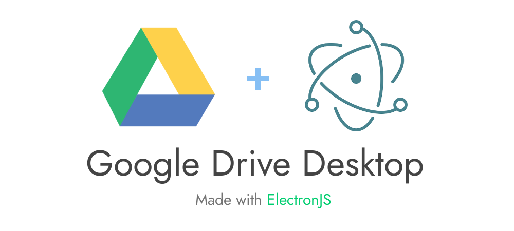
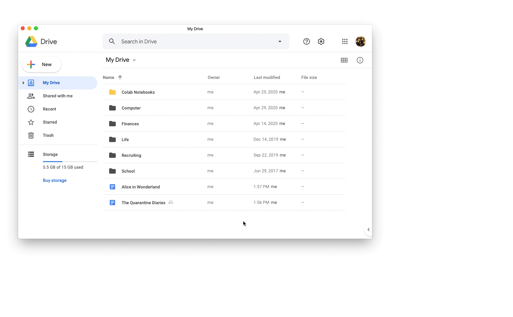
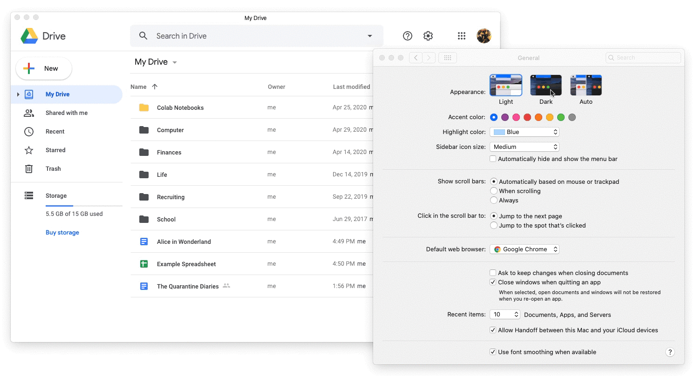
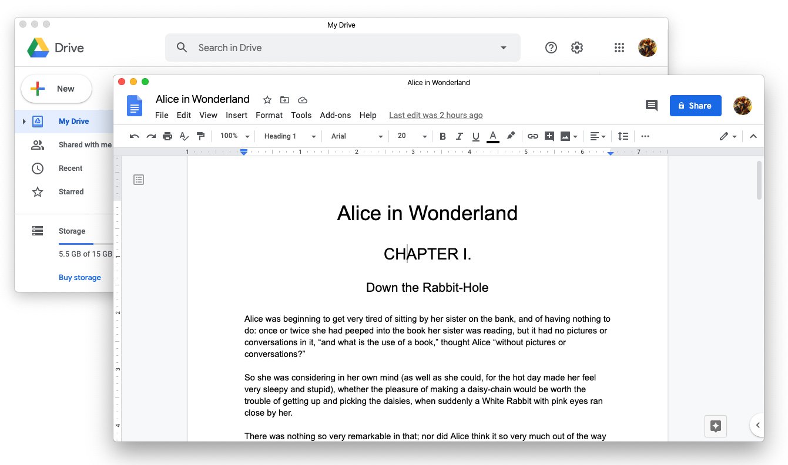
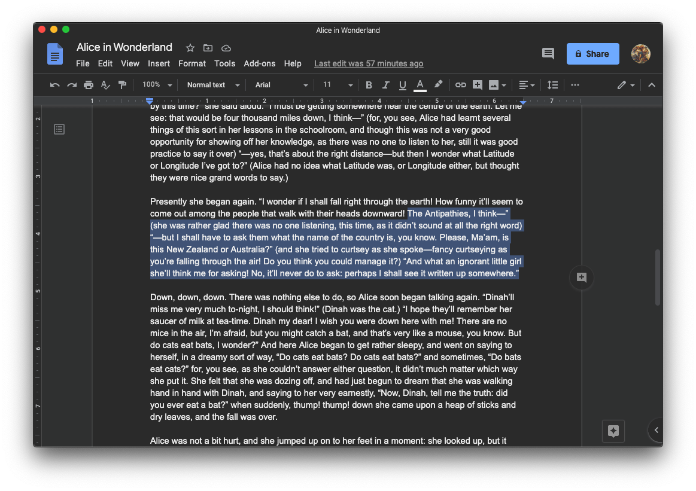

**If you like what you see, consider buying me a cup of [coffee](https://www.buymeacoffee.com/alexgkim) ☕.**


[](mailto:alexgkim205@gmail.com)


---

### [04/16/2021]
#### Thank you everyone who gave this app a shot, it's been a great learning opportunity for me!
#### Unfortunately, I won't be able to continue maintaining G-Desktop-Suite due to time constraints. However, this repository is open to new lead maintainers! If you're interested, shoot me an email at alexgkim205@gmail.com.

---

Have you ever wished you had a no-frills, word-processing desktop app dedicated to just Google Drive? Annoyed at having to click the Go to My Drive button everytime you visit [https://drive.google.com](https://drive.google.com)? Want a Microsoft Word-esque experience for your Google Drive? Or simply looking to separate Google Drive from the other bajillion tabs that you opened for your research paper? Look no further!

G Desktop Suite is a desktop wrapper for Google Drive built with [ElectronJS](https://github.com/electron/electron). Give it a try, and if you like what you see, share it with your friends!



### 🌙 Dark Mode is here!

As of `v.conscious-club/0.2.0`, the app will automatically adjust to your OS's dark mode settings.



## 📀 Installation

### Release page

Download the [latest releases](https://github.com/alexkim205/G-Desktop-Suite/releases) for **Windows**, **Linux**, or **MacOS**.

### For MacOS/Linux users with Homebrew

This method is highly recommended for users who want the latest release without the hassle of downloading the executable each time. Learn more about how to get [`homebrew`](https://brew.sh/) and [`homebrew-cask`](https://github.com/Homebrew/homebrew-cask).

The following script will install `G Desktop Suite.app` into your `Applications/` folder.

```sh
brew cask install g-desktop-suite
```

Run `brew cask upgrade` to get the latest version of the app.

### For Arch Linux and related distributions

Install the AUR package [`g-desktop-suite-git`](https://aur.archlinux.org/packages/g-desktop-suite-git/). Below is an example with [`yay`](https://github.com/Jguer/yay), but any AUR manager will work.

```sh
yay -S g-desktop-suite-git
```

### 🎶 Versions

- v.0.3.0-0.3.1 // mr-finish-line
- v.0.2.0-0.2.1 // conscious-club
- v.0.1.0 // fugue-state
- v.0.0.3 // dean-town
- v.0.0.2 // funky-duck
- v.0.0.1 // aunt-leslie

Version names inspired by Vulfpeck songs. They're a great band, check them out [here](https://vulfpeck.com/).

## 📸 Action Shots





## ✏️ Development

To build the app locally, clone the repository, install all dependencies, and run the available npm scripts.

```sh
git clone https://github.com/alexkim205/G-Desktop-Suite.git
cd G-Desktop-Suite
yarn install
```

```sh
$ yarn run
yarn run v1.22.4
   - build
      electron-builder -mwl -p never
   - build-cask
      ./Casks/update.sh $npm_package_version
   - clean
      concurrently "prettier './**/*.js' --write" "eslint ./**/*.js --fix"
   - clean-check
      concurrently "prettier './**/*.js' --list-different" "eslint ./**/*.js"
   - deploy
      electron-builder -mwl -p onTagOrDraft
   - deploy-cask
      cask-repair g-desktop-suite -v $npm_package_version -b
   - dev
      cross-env NODE_ENV=development electron .
   - pack
      electron-builder --dir && yarn update-cask
   - start
      electron .
```

To build production ready applications for macos (dmg), windows (exe), and linux (sh), run `yarn build`.

🛎️ **Have suggestions?** Feel free to create an issue or make a pull request.

🤝 **Want to contribute?** Check out the `TODO.md`!

## 📜 MIT License

_Disclaimer: Not affiliated with Google._
